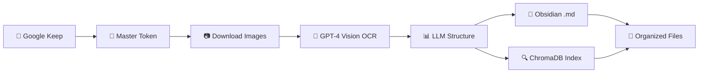

# 📝 OCR Keep → Obsidian + Vector DB

[](https://python.org)
[](LICENSE)
[](https://openai.com)
[](https://chromadb.com)

> **Transforme suas notas manuscritas em conhecimento digital estruturado**

Pipeline inteligente e automatizado que extrai, processa e indexa notas manuscritas do Google Keep, utilizando OCR avançado com GPT-4 Vision, estruturação semântica com LLMs, e armazenamento integrado em Obsidian (.md) + ChromaDB para busca semântica.


## ✨ Visão Geral

Este projeto resolve o problema de **digitalização inteligente de notas manuscritas**, oferecendo um pipeline completo que:

- 🔗 **Conecta automaticamente** ao Google Keep via master token
- 🎯 **Filtra inteligentemente** notas por labels/tags e datas
- 🤖 **OCR de alta precisão** usando GPT-4 Vision para manuscritos
- 📊 **Estrutura semanticamente** o conteúdo com LLMs em JSON padronizado
- 📝 **Gera arquivos Markdown** otimizados para Obsidian com frontmatter YAML
- 🔍 **Indexa semanticamente** no ChromaDB com embeddings multilingues
- 🔄 **Executa automaticamente** em horários programados (ideal para servidores)
- 📁 **Organiza inteligentemente** arquivos processados e controla duplicatas
- ⚙️ **Configuração flexível** via .env com caminhos personalizáveis
- 📊 **Logs completos** com timestamps e monitoramento de status

### 🎯 Casos de Uso

- **📚 Pesquisadores**: Digitalize anotações de campo e literatura
- **🎓 Estudantes**: Transforme notas de aula em material de estudo estruturado  
- **💼 Profissionais**: Organize reuniões e brainstorming em conhecimento pesquisável
- **✍️ Escritores**: Capture ideias manuscritas em sistema digital organizado
- **🏠 Uso Pessoal**: Automatize organização de listas, lembretes e notas cotidianas

## 🛠️ Tecnologias Utilizadas

| Componente | Tecnologia | Função |
|------------|------------|---------|
| **OCR** | GPT-4 Vision | Extração de texto manuscrito |
| **Backend** | Python 3.8+ | Pipeline principal |
| **Keep API** | gkeepapi | Conexão com Google Keep |
| **Vector DB** | ChromaDB | Busca semântica |
| **Embeddings** | Sentence Transformers | Indexação multilíngue |
| **Output** | Markdown + YAML | Compatibilidade Obsidian |
| **Config** | python-dotenv | Carregamento automático .env |
| **Automação** | Bash Scripts | Execução agendada |

## 📋 Requisitos

### Obrigatórios
- **Python 3.8+** (recomendado 3.10+)
- **Conta Google** com Google Keep ativo
- **OpenAI API Key** com acesso ao GPT-4 Vision
- **Google Keep Master Token** ([como obter](CONFIG.md))

### Sistema Operacional
- ✅ Linux (testado no Ubuntu 20.04+)
- ✅ macOS (testado no macOS 12+)
- ⚠️ Windows (suporte via WSL)

## ⚡ Instalação Rápida

### 1️⃣ Clone e Configure o Ambiente

```bash
# Clone o repositório
git clone https://github.com/thiago-gmacedo/ocr-keep-obsidian.git
cd ocr-keep-obsidian

# Crie um ambiente virtual (recomendado)
python -m venv venv
source venv/bin/activate  # Linux/macOS
# ou: venv\Scripts\activate  # Windows

# Instale as dependências
pip install -r requirements.txt
```

### 2️⃣ Configure as Credenciais

```bash
# Crie o arquivo de configuração
mkdir -p .env
cp CONFIG.md .env/  # Use como referência

# Edite o arquivo de configuração
nano .env/config  # ou seu editor preferido
```

**Estrutura do `.env/config`:**
```env
# 🔑 Credenciais obrigatórias
GOOGLE_EMAIL=seu.email@gmail.com
GOOGLE_MASTER_TOKEN=seu_master_token_aqui
OPENAI_API_KEY=sk-sua_chave_openai_aqui

# 📁 Caminhos personalizados (opcional)
OBS_PATH=~/Documents/ObsidianVault    # Padrão: ./obsidian_notes
CHROMA_DB_PATH=~/databases/chroma     # Padrão: ./chroma_db
```

### 3️⃣ Verificação do Setup

```bash
# Torne os scripts executáveis
chmod +x setup_check.sh run_loop.sh

# Execute verificação automática
./setup_check.sh
```

✅ **Pronto!** Se a verificação passou, seu sistema está configurado corretamente.

## 🚀 Como Usar

### 📖 Comandos Principais

| Comando | Descrição | Exemplo |
|---------|-----------|---------|
| `python -m src.main` | Executa pipeline completo | Processa todas as notas de hoje |
| `python -m src.main "Label"` | Filtra por label específica | `python -m src.main "Anotações"` |
| `python scripts/query_interface.py` | Interface de busca ChromaDB | Busca semântica interativa |
| `./run_loop.sh` | Execução agendada (servidor) | Roda às 01:00 e 04:00 diariamente |
| `./setup_check.sh` | Verificação do sistema | Diagnóstico completo |
| `tail -f logs/pipeline.log` | Monitorar logs em tempo real | Ver execução atual |

### 💻 Uso Básico

```bash
# Ative o ambiente virtual
source venv/bin/activate

# Execute o pipeline uma vez
python -m src.main

# Execute com filtro de label
python -m src.main "Estudos"

# Use a interface de busca ChromaDB
python scripts/query_interface.py

# Verificar se tudo está funcionando
./setup_check.sh
```

### 🖥️ Uso em Servidor (Automático)

```bash
# Inicie execução contínua (ideal para VPS/servidor)
./run_loop.sh

# O sistema executará automaticamente às 01:00 e 04:00
# Para parar: Ctrl+C ou kill do processo
```

### 📊 Monitoramento

```bash
# Ver logs em tempo real
tail -f logs/pipeline.log

# Ver últimas 20 linhas do log
tail -20 logs/pipeline.log

# Verificar status do sistema
./setup_check.sh

# Ver arquivos gerados
ls -la obsidian_notes/
ls -la chroma_db/
```

## 📁 Estrutura do Projeto

```
📦 ocr-keep-obsidian/
├── 🚀 src/                          # Módulos principais reorganizados
│   ├── __init__.py                  # 📋 Inicialização do pacote
│   ├── main.py                      # 🎯 Pipeline central
│   ├── parser.py                    # 🧠 Parsing LLM estruturado
│   ├── obsidian_exporter.py         # 📝 Interface de exportação
│   ├── obsidian_writer.py           # 📝 Gerador Markdown/Obsidian  
│   ├── ocr_extractor.py             # 📷 Conectividade Keep + OCR
│   ├── chroma_indexer.py            # 🔍 Indexador ChromaDB
│   └── README_CHROMA.md             # 📖 Docs ChromaDB
├── 🔧 scripts/                      # Scripts auxiliares
│   ├── query_interface.py           # 🔍 Interface CLI ChromaDB
│   ├── auto_indexer.py              # 🔄 Indexação automática
│   └── test_chroma_indexer.py       # 🧪 Testes ChromaDB
├── 📷 images/                       # Imagens baixadas
│   └── processed/                   # ✅ Imagens processadas
├── 📝 obsidian_notes/               # 📁 Arquivos .md gerados
├── 🔍 chroma_db/                    # 💾 Banco vetorial
├── 📊 logs/                         # 📋 Logs do sistema
│   └── pipeline.log                 # 📄 Log principal
├── ⚙️ .env/                         # 🔐 Configurações
│   └── config                       # 🔑 Credenciais
├── 🗃️ archive/                      # 📦 Arquivos legados
├── 🔧 run_loop.sh                   # ⏰ Execução agendada
├── 🔧 setup_check.sh                # ✅ Verificação setup
├── 📋 requirements.txt              # 📦 Dependências Python
├── 📖 README.md                     # 📚 Este arquivo
├── ⚙️ CONFIG.md                     # 🔧 Guia configuração
└── 📄 .processed_notes.json         # 🔄 Controle duplicatas
```

### 📂 Diretórios Importantes

| Diretório | Propósito | Configurável |
|-----------|-----------|--------------|
| `obsidian_notes/` | Arquivos .md gerados | ✅ via `OBS_PATH` |
| `chroma_db/` | Banco vetorial ChromaDB | ✅ via `CHROMA_DB_PATH` |
| `images/` | Imagens baixadas do Keep | ❌ Fixo |
| `logs/` | Logs de execução | ❌ Fixo |

## 🔄 Como Funciona o Pipeline



### 🎯 Etapas Detalhadas

1. **🔗 Conexão**: Autentica no Google Keep via master token (com python-dotenv automático)
2. **🎯 Filtragem**: Busca notas de hoje com imagens (opcionalmente por label)
3. **📥 Download**: Baixa imagens das notas não processadas anteriormente
4. **🤖 OCR**: Extrai texto manuscrito usando GPT-4 Vision
5. **📊 Estruturação**: Organiza conteúdo em JSON padronizado via parser module
6. **📝 Geração**: Cria arquivos .md compatíveis com Obsidian via obsidian_exporter
7. **🔍 Indexação**: Gera embeddings e indexa no ChromaDB
8. **📁 Organização**: Move imagens para pasta `processed/`
9. **📋 Controle**: Registra operação para evitar duplicatas futuras

### 🎨 Exemplo de Transformação

**📷 Input**: Imagem de nota manuscrita
```
✍️ "Reunião cliente X
   - Discutir proposta
   - Agendar follow-up
   💡 Ideia: integração API"
```

**📊 JSON Estruturado**:
```json
{
  "title": "Reunião Cliente X",
  "data": "29/05/25",
  "summary": "Reunião para discussão de proposta e follow-up",
  "keywords": ["reunião", "cliente", "proposta", "API"],
  "tasks": [
    {"task": "Discutir proposta", "status": "done"},
    {"task": "Agendar follow-up", "status": "todo"}
  ],
  "notes": ["Ideia: integração API"],
  "reminders": []
}
```

**📝 Obsidian Output**:
```markdown
---
title: "Reunião Cliente X"
created: "2025-05-29T00:00:00"
summary: "Reunião para discussão de proposta e follow-up"
keywords: ["reunião", "cliente", "proposta", "API"]
---

# Reunião Cliente X

## 📋 Tarefas
- ✅ Discutir proposta  
- 📌 Agendar follow-up

## 📝 Notas
- 💡 Ideia: integração API
```

## ⚙️ Configuração Avançada

### 🔐 Obtendo o Master Token do Google Keep

O master token é mais seguro que armazenar senhas e tem validade estendida.

**Métodos disponíveis:**
1. **📖 Guia Oficial**: [Como obter master token](CONFIG.md)
2. **🔧 Scripts Auxiliares**: [Token Scripts Repository](https://github.com/thiago-gmacedo/token-scripts)
3. **📚 Referência Java**: [GPSAuth Java](https://github.com/rukins/gpsoauth-java)

### 🎛️ Variáveis de Ambiente

```env
# 🔑 OBRIGATÓRIAS
GOOGLE_EMAIL=seu.email@gmail.com
GOOGLE_MASTER_TOKEN=ya29.a0AfH6SMB...
OPENAI_API_KEY=sk-proj-abc123...

# 📁 OPCIONAIS (caminhos personalizados)
OBS_PATH=~/Documents/MyObsidianVault
CHROMA_DB_PATH=~/data/vectordb
```

### ⏰ Configuração de Horários

Edite `run_loop.sh` para personalizar horários de execução:

```bash
# Linha ~21: Modificar função is_execution_time()
if [[ ("$current_hour" == "06" || "$current_hour" == "18") && "$current_minute" -lt "05" ]]; then
    return 0  # Agora executa às 6h e 18h
fi
```

### 🔍 Configuração ChromaDB

O sistema cria automaticamente:
- **Coleção**: `handwritten_notes`
- **Modelo**: `paraphrase-multilingual-MiniLM-L12-v2`
- **Metadados**: Título, data, palavras-chave, resumo

Para consultas avançadas, veja [README_CHROMA.md](src/README_CHROMA.md).

## 🧩 Módulos do Sistema

### 📦 Módulos Principais (`src/`)

| Módulo | Responsabilidade | Principais Funções |
|--------|------------------|-------------------|
| **`main.py`** | 🎯 Pipeline central | Orquestração do fluxo completo |
| **`parser.py`** | 🧠 Parsing LLM | `parse_ocr_text()` - estruturação JSON |
| **`obsidian_exporter.py`** | 📝 Exportação | `convert_to_md()` - interface unificada |
| **`ocr_extractor.py`** | 📷 OCR + Keep | Conectividade e extração de imagens |
| **`obsidian_writer.py`** | 📄 Formatação | Geração de arquivos Markdown |
| **`chroma_indexer.py`** | 🔍 Vector DB | Indexação e busca semântica |

### 🔧 Scripts Auxiliares (`scripts/`)

| Script | Função | Como Usar |
|--------|--------|-----------|
| **`query_interface.py`** | 🔍 Busca ChromaDB | `python scripts/query_interface.py` |
| **`auto_indexer.py`** | 🔄 Indexação batch | Re-indexação de arquivos existentes |
| **`test_chroma_indexer.py`** | 🧪 Testes | Validação do ChromaDB |

### 💡 Benefícios da Reorganização

- **🎯 Separação de responsabilidades**: Cada módulo tem função específica
- **🔧 Manutenibilidade**: Código mais fácil de manter e debug
- **🧪 Testabilidade**: Módulos independentes facilitam testes
- **🔄 Reutilização**: Funções podem ser importadas individualmente
- **📦 Estrutura de pacote**: Import paths mais limpos e organizados
- **⚡ Performance**: Carregamento otimizado de dependências

## 🔍 Exemplo de Saída Completa

### 🎯 Busca Semântica no ChromaDB

```python
# Exemplo de busca no ChromaDB usando interface
python scripts/query_interface.py

# Ou programaticamente
from src.chroma_indexer import ChromaIndexer

indexer = ChromaIndexer()
results = indexer.query_similar_notes("reunião cliente", n_results=3)

# Retorna notas similares com scores de similaridade
```

**Interface CLI de Busca:**
```bash
# Busca interativa
python scripts/query_interface.py

# Busca direta
python scripts/query_interface.py -q "planejamento semanal"

# Ver estatísticas
python scripts/query_interface.py --stats

# Listar todas as notas
python scripts/query_interface.py --list
```

**Uso dos módulos reorganizados:**
```python
# Importar módulos específicos
from src.parser import parse_ocr_text
from src.obsidian_exporter import convert_to_md
from src.chroma_indexer import ChromaIndexer

# Usar parser independentemente
structured_data = parse_ocr_text("texto manuscrito extraído")

# Converter para Obsidian
markdown_file = convert_to_md(structured_data, output_dir="./notas")

# Buscar no ChromaDB
indexer = ChromaIndexer()
results = indexer.query_similar_notes("reunião", n_results=5)
```

### 📊 Estrutura JSON Completa

```json
{
  "title": "28/05/25 - Planejamento Semanal",
  "data": "28/05/25",
  "summary": "Organização de tarefas e metas da semana",
  "keywords": ["planejamento", "tarefas", "metas", "produtividade"],
  "tasks": [
    {"task": "Finalizar apresentação", "status": "done"},
    {"task": "Revisar código do projeto", "status": "todo"},
    {"task": "Agendar reunião com cliente", "status": "todo"}
  ],
  "notes": [
    "Priorizar tarefas urgentes",
    "Reservar tempo para revisão de código"
  ],
  "reminders": [
    "Ligar para cliente às 14h",
    "Backup do projeto na sexta"
  ]
}
```

### 📝 Arquivo Obsidian Gerado

```markdown
---
title: "28/05/25 - Planejamento Semanal"
created: "2025-05-28T00:00:00"
last_modified: "2025-05-29T01:23:45"
embedding_date: "2025-05-29T01:23:45"
source_id: "keep_280525_planejamento_semanal"
vector_id: "a1b2c3d4e5f6g7h8i9j0k1l2m3n4o5p6q7r8s9t0u1v2w3x4y5z6"
summary: "Organização de tarefas e metas da semana"
keywords:
  - "planejamento"
  - "tarefas" 
  - "metas"
  - "produtividade"
---

# 28/05/25 - Planejamento Semanal

## 📝 Resumo
Organização de tarefas e metas da semana

## 📋 Tarefas
- ✅ Finalizar apresentação
- 📌 Revisar código do projeto  
- 📌 Agendar reunião com cliente

## 📓 Notas
- Priorizar tarefas urgentes
- Reservar tempo para revisão de código

## ⏰ Lembretes
- 📞 Ligar para cliente às 14h
- 💾 Backup do projeto na sexta

---
*Processado automaticamente pelo OCR Keep Pipeline*
```

## 🚨 Solução de Problemas

### ❌ Problemas Comuns e Soluções

| Problema | Possível Causa | Solução |
|----------|---------------|---------|
| 🔐 **Erro de autenticação Keep** | Master token inválido/expirado | Regenerar token seguindo [CONFIG.md](CONFIG.md) |
| 💳 **Erro API OpenAI** | Chave inválida ou sem créditos | Verificar chave e saldo na conta OpenAI |
| 📋 **Nenhuma nota encontrada** | Sem notas hoje ou label inexistente | Verificar notas no Keep e labels utilizadas |
| 📁 **Erro de permissão** | Diretórios sem permissão de escrita | `chmod 755` nos diretórios ou usar `sudo` |
| 🐍 **Módulos não encontrados** | Ambiente virtual não ativado | `source venv/bin/activate` |

### 🔧 Comandos de Diagnóstico

```bash
# 🩺 Verificação completa do sistema
./setup_check.sh

# 📊 Verificar logs detalhados
tail -50 logs/pipeline.log

# 🐍 Verificar ambiente Python
python --version
pip list | grep -E "(openai|gkeepapi|chromadb|python-dotenv)"

# 📁 Verificar permissões de diretórios
ls -la obsidian_notes/ chroma_db/ logs/

# 🔐 Verificar arquivo de configuração
cat .env/config | grep -v TOKEN  # Mostra config sem expor tokens

# 🔍 Testar interface de busca
python scripts/query_interface.py --stats
```

### 🆘 Debug Modo Verbose

```bash
# Executar com logs detalhados
python -m src.main --verbose

# Ou habilitar debug no código
export PYTHONPATH=.
export DEBUG=1
python -m src.main
```

### 📞 Suporte

1. **📖 Documentação**: Verifique [CONFIG.md](CONFIG.md) para setup detalhado
2. **🔍 Issues**: Reporte problemas no [GitHub Issues](https://github.com/thiago-gmacedo/ocr-keep-obsidian/issues)
3. **📧 Contato**: Para dúvidas específicas, abra uma issue com:
   - Logs relevantes (sem expor credenciais)
   - Versão do Python e SO
   - Passos para reproduzir o problema

## 🗺️ Roadmap & Próximos Passos

### 🎯 Em Desenvolvimento (v2.1.0)
- [ ] **🌐 Interface Web**: Dashboard para monitoramento e controle
- [ ] **📱 App Mobile**: Companion app para captura direta
- [ ] **🔄 Sync Bidireccional**: Obsidian → Keep para edições
- [ ] **🎨 Themes Obsidian**: Templates customizáveis para diferentes tipos de nota
- [ ] **🔍 Busca Avançada**: Melhorias na interface de busca semântica

### 🚀 Planejado (v2.2.0)
- [ ] **🤖 Auto-categorização**: IA para classificação automática de notas
- [ ] **📊 Analytics**: Dashboard com estatísticas de produtividade
- [ ] **🔗 Integrações**: Notion, Anki, Logseq
- [ ] **🌍 Multi-idiomas**: Suporte completo a idiomas não-latinos
- [ ] **⚡ Performance**: Otimizações no pipeline de processamento

### 💡 Ideias Futuras
- [ ] **🧠 Knowledge Graph**: Visualização de conexões entre notas
- [ ] **🎤 Audio OCR**: Processamento de notas de voz
- [ ] **📷 Batch Processing**: Processamento de múltiplas imagens simultaneamente
- [ ] **☁️ Cloud Deploy**: Deploy automatizado em cloud (AWS, GCP, Azure)

### 🤝 Como Contribuir

**Áreas que precisam de ajuda:**
- 🐛 **Testing**: Testar em diferentes SOs e configurações
- 📖 **Documentação**: Melhorar guides e tutoriais
- 🌍 **Localização**: Tradução para outros idiomas
- 🎨 **UI/UX**: Design da interface web planejada
- 🔧 **DevOps**: Containerização e deploy automatizado

**Para contribuir:**
1. 🍴 Fork o projeto
2. 🌿 Crie uma branch para sua feature (`git checkout -b feature/AmazingFeature`)
3. 💾 Commit suas mudanças (`git commit -m 'Add some AmazingFeature'`)
4. 📤 Push para a branch (`git push origin feature/AmazingFeature`)
5. 🔃 Abra um Pull Request


## 📄 Licença

Este projeto está licenciado sob a **MIT License** - veja o arquivo [LICENSE](LICENSE) para detalhes.

```
MIT License

Copyright (c) 2025 Thiago Macedo

Permission is hereby granted, free of charge, to any person obtaining a copy
of this software and associated documentation files (the "Software"), to deal
in the Software without restriction, including without limitation the rights
to use, copy, modify, merge, publish, distribute, sublicense, and/or sell
copies of the Software...
```

### 🤝 Código de Conduta

Este projeto adere ao [Contributor Covenant](https://www.contributor-covenant.org/) código de conduta. Ao participar, você concorda em seguir este código.

## 🙏 Agradecimentos

- **OpenAI** pelo GPT-4 Vision que tornou OCR de manuscritos possível
- **ChromaDB** pela excelente biblioteca de vector database
- **gkeepapi** por tornar a integração com Google Keep simples
- **Sentence Transformers** pelos embeddings multilingues de qualidade
- **Obsidian** pela inspiração no formato de notas estruturadas

## 📬 Contato & Suporte

- **📧 Email**: [seu-email@exemplo.com](mailto:seu-email@exemplo.com)
- **🐙 GitHub**: [@thiago-gmacedo](https://github.com/thiago-gmacedo)
- **🐛 Issues**: [Reportar Problemas](https://github.com/thiago-gmacedo/ocr-keep-obsidian/issues)
- **💬 Discussões**: [GitHub Discussions](https://github.com/thiago-gmacedo/ocr-keep-obsidian/discussions)

---

<div align="center">

**🚀 Transforme suas ideias manuscritas em conhecimento digital estruturado**

[](https://github.com/thiago-gmacedo/ocr-keep-obsidian)
[](https://github.com/thiago-gmacedo/ocr-keep-obsidian/fork)

*Desenvolvido com ❤️ por [Thiago Macedo](https://github.com/thiago-gmacedo)*

</div>